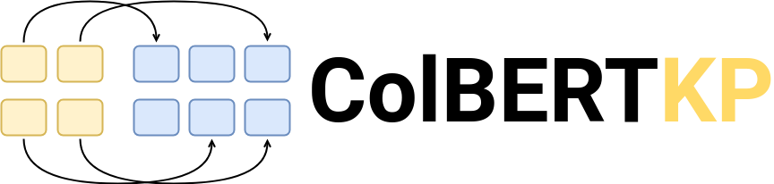

[![Contributors][contributors-shield]][contributors-url]
[![Forks][forks-shield]][forks-url]
[![Stargazers][stars-shield]][stars-url]
[![Issues][issues-shield]][issues-url]
[![MIT License][license-shield]][license-url]

<br />
<br />
<div align="center">
  <p>
    
  </p>
  <h3 align="center">ColBERTKP</h3>
  <em align="center">
    Beyond Questions: Leveraging ColBERT for Keyphrase Search
  </em>
</div>

## Environment Setup

1. Follow the instructions to set up `pyterrier` found in the [repository](https://github.com/terrier-org/pyterrier).
2. Install additional packages: `pip install requirements.txt`
3. Trained models will be made available when the anonymisation process ends.

## Training Keyphrase Models

### Generate Keyphrase Triples

Steps to transform MSMarco triples from \<query, relevant_doc, non_relevant_doc\> to \<keyphrases, relevant_doc, non_relevant_doc\>.

1. [Download](https://msmarco.z22.web.core.windows.net/msmarcoranking/triples.train.small.tar.gz) the MSMarco triples small file.
2. Follow the steps in the [Mistral HF repository](https://huggingface.co/mistralai/Mistral-7B-Instruct-v0.2) to have access to the model.
3. Add your [HF token](https://huggingface.co/settings/tokens) to the `query_2_kwds.py` script.
4. Run the `query_2_kwds.py` script:

```
python query_2_kwds.py --input <path_to_msmarco_triples> --output <output_triples_path> --batch_size <num_of_triples_per_batch>
```

### Train ColBERTKP<sub>QD</sub>

```
python -m colbert.train --amp --doc_maxlen 180 --mask-punctuation --bsize 256 --accum 1 --triples <msmarco_kps_triples_path> --root <output_model_path> --experiment <exp_name> --run <run_name> --similarity cosine --checkpoint <checkpoint_path>
```

### Train ColBERTKP<sub>Q</sub> (encoder-only)

1. Include the files in the `train_files` in the ColBERT codebase (you can use the default [ColBERT repo](https://github.com/stanford-futuredata/ColBERT/tree/colbertv1) or the one from the [repro paper](https://github.com/Xiao0728/ColStar_VirtualAppendix/tree/main/ColStar_models/ColBERT)).

```
cp src/train_files/train_encoder.py <path_to_colbert_codebase>/
cp training_colbertkp_enc.py <path_to_colbert_codebase>/training/
cp src/train_files/colbert_kp_encoder.py <path_to_colbert_codebase>/modeling/
```

2. Run the encoder-only training script:

```
python -m colbert.train_encoder_only --amp --doc_maxlen 180 --mask-punctuation --bsize 256 --accum 1 --triples <msmarco_kps_triples_path> --root <output_model_path> --experiment <exp_name> --run <run_name> --similarity cosine --checkpoint <checkpoint_path>
```

## Run Evaluation

### Index MSMarco passages

To replicate this work we need to create two different indices: one for the default ColBERT model and for the ColBERTKP<sub>Q</sub>, and the other one for ColBERTKP<sub>QD</sub>.

We can create a new index using the `pyterrier_colbert` library. Use the default ColBERT checkpoint or the ColBERTKP<sub>QD</sub> depending on the model you aim to test.

```
from pyterrier_colbert.indexing import ColBERTIndexer
indexer = ColBERTIndexer("/path/to/checkpoint.dnn", "/path/to/index", "index_name")
indexer.index(dataset.get_corpus_iter())
```

### Re-Ranking Evaluation

Replicate the re-ranking setup evaluation for both original and keyphrase-based queries. Change the indices path in the code before running the script. Note that this code uses the results files in the repository, to avoid that change the `save_dir` parameter in `pt.Experiment`.

```
python eval_reranking.py
```

### End-to-End Evaluation

Replicate the end-to-end setup evaluation for both original and keyphrase-based queries. Change the indices path in the code before running the script. Note that this code uses the results files in the repository, to avoid that change the `save_dir` parameter in `pt.Experiment`.

```
python eval_e2e.py
```

### Manual Queries Experiment

Replicate the manually labelled queries experiment. Note that this code uses the results files in the repository, to avoid that, change the `save_dir` parameter in `pt.Experiment`.

```
python eval_manual_kps.py
```

### MonoT5KP Experiment

Replicate the generalisation experiment. Note that this code uses the results files in the repository, to avoid that change the `save_dir` parameter in `pt.Experiment`. The model is available but toy can train your own model using the [pygaggle](https://github.com/castorini/pygaggle/blob/master/docs/experiments-monot5-gpu.md) library.

```
python eval_monot5kp.py
```

### Hybrid Queries Experiment

Replicate the mixed queries experiment. Note that this code uses the results files in the repository, to avoid that, change the `save_dir` parameter in `pt.Experiment`.

```
python eval_hybrid.py
```

<!-- MARKDOWN LINKS & IMAGES -->
[contributors-shield]: https://img.shields.io/github/contributors/JorgeGabin/ColBERTKP.svg?style=for-the-badge
[contributors-url]: https://github.com/JorgeGabin/ColBERTKP/graphs/contributors
[forks-shield]: https://img.shields.io/github/forks/JorgeGabin/ColBERTKP.svg?style=for-the-badge
[forks-url]: https://github.com/JorgeGabin/ColBERTKP/network/members
[stars-shield]: https://img.shields.io/github/stars/JorgeGabin/ColBERTKP.svg?style=for-the-badge
[stars-url]: https://github.com/JorgeGabin/ColBERTKP/stargazers
[issues-shield]: https://img.shields.io/github/issues/JorgeGabin/ColBERTKP.svg?style=for-the-badge
[issues-url]: https://github.com/JorgeGabin/ColBERTKP/issues
[license-shield]: https://img.shields.io/github/license/JorgeGabin/ColBERTKP.svg?style=for-the-badge
[license-url]: https://github.com/JorgeGabin/ColBERTKP/blob/master/LICENSE.txt

